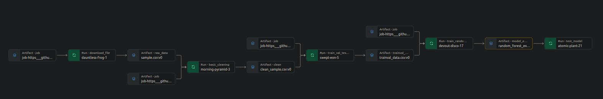

# Build a ML Pipeline for Short term Rental Prices in NYC

## Description
This project is a part udacity course machine learning dev ops nanodegree: Building a Reproducible Model Workflow

## Dependencies
 - mlflow 

## Installation

```bash
pip install mlflow
```
## Project usage
Building reproducible a ML pipeline to predict rental prices for airbnb rentals


The pipeline shows each component with input and output artifacts for each component.

* ```download_data```: Upload the data 
* ```basic_cleaning```: Clean the dataset and handle outliers
* ```train_val_test_split```: Data validation and data split
* ```train_random_forest```: Builds pipeline and trains Machine learning model 
* ```test_model```: Evaluates the model on new test data.

Run pipeline. 
```bash
mlflow run .
```

Run evaluation.
```bash
mlflow run . -P steps=test_regression_model
```

Run Multiple hyperparameters to train model.
```bash
mlflow run . \
-P steps=train_random_forest  \
-P hydra_options="modeling.random_forest.max_features=10,50,30 modeling.random_forest.max_features=0.1,0.33,0.5,0.75,1 -m"
  ```

Run the pipeline directly from github using a different sample of data.
```bash
mlflow run https://github.com/M-Wakeb/build-ml-pipeline-for-short-term-rental-prices \
            -v [RELEASE_VERSION] \
            -P hydra_options="elt.sample='sample2.csv'"
```
## Links to project
```wandb``` https://wandb.ai/m-almohaya-wakeb_data/nyc_airbnb?nw=nwusermalmohaya
```Git```  https://github.com/M-Wakeb/build-ml-pipeline-for-short-term-rental-prices